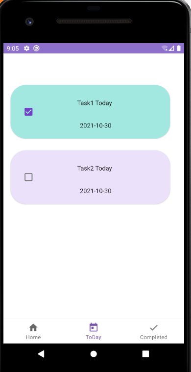
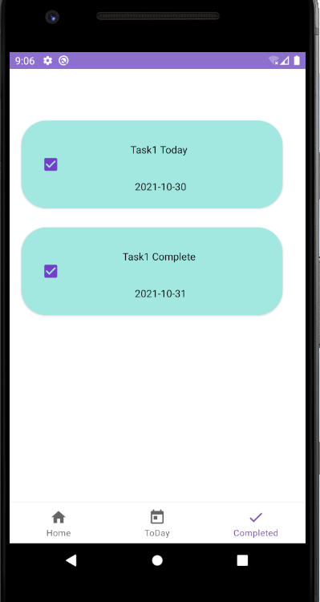
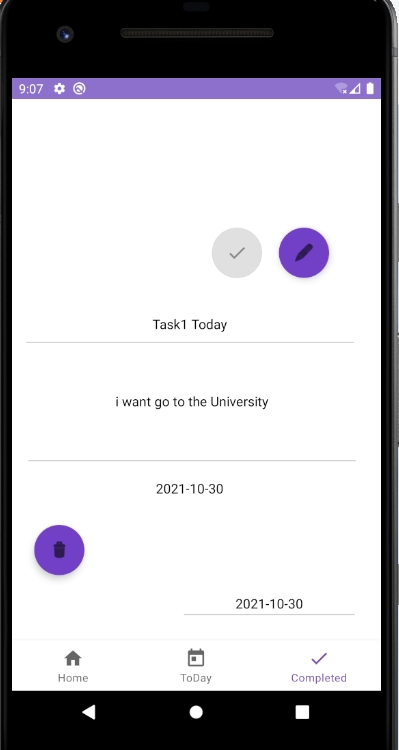
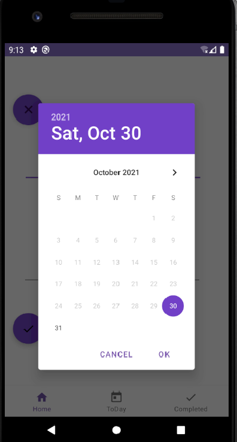
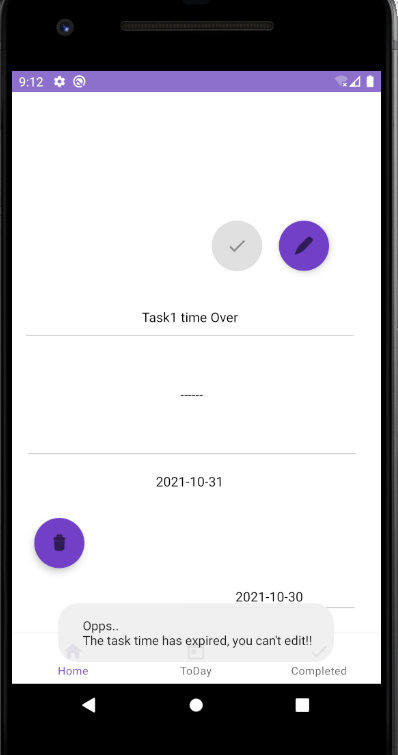
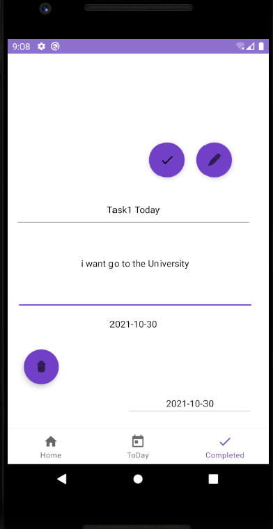
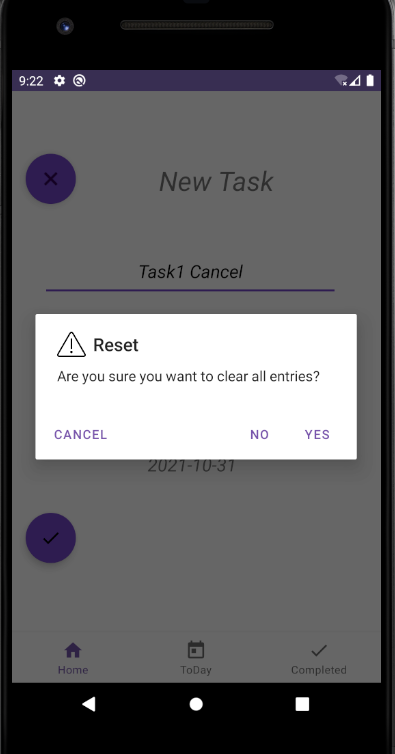
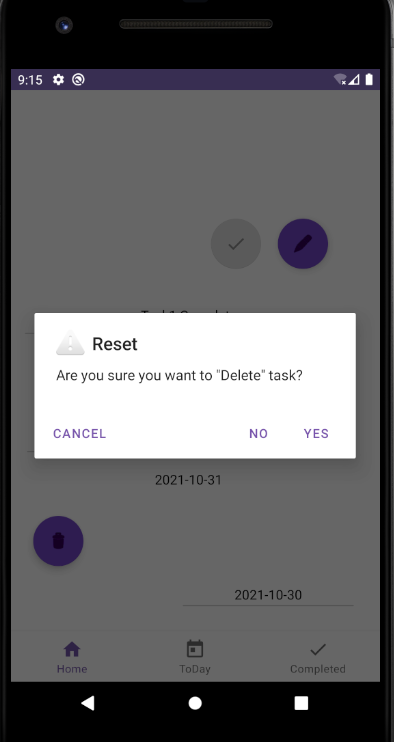

# ToDo-list
#ToDo
https://devpost.com/software/todo-odahsm/joins/Vv8rXwA-ctK0l51mFgniMQ
---

# ToDo-list
#ToDo
---

<!--- Replace <NadiaAliAlmrashi>
with your Github Username and <https://github.com/NadiaAliAlmrashi/ToDo-list> with the name of your repository. -->
<!--- You can find both of these in the url bar when you open your repository in github. -->

## :scroll: Description
---
User task management application "ToDo"
The application allows adding many tasks, modifying, deleting
and as it categorizes tasks into daily and completed categories
and unclassified tasks .The application marks the completed task in green color
when the appointments are missed marked its gray color,
and also it is not possible to click on the completion of the task or modify it.

It was a journey full of passion and learning,

 and I learned the importance of searching for information and spotting mistakes.
## :bulb: Motivation and Context
---
Write your motivation here

Learn everything new and useful

## :camera_flash: Screenshots
---
### Today Task

### Complet Task

###Description Task

###Deu Date Task

###Task Over Time can't be edit

###Edit TasK Enabled EditText

###Cancel Task

###Delet Task

##cancel

